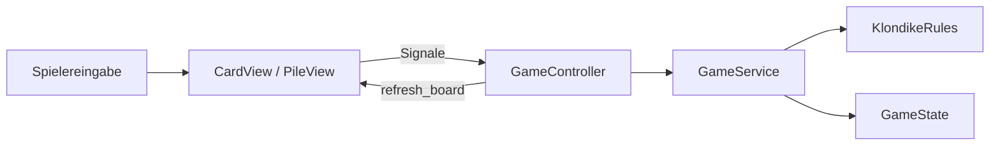

<div align="center">

# ♠ Klondike Solitaire

**Ein klassisches Solitaire-Spiel, entwickelt mit Godot 4.**

Ereignisgesteuerte Spiellogik, responsive Darstellung und animierte Karteneffekte.

</div>

---

## Über das Projekt

Dieses Projekt setzt klassisches Klondike Solitaire in Godot um. Spiellogik, Regeln und Darstellung sind voneinander getrennt, sodass neue Kartenstile, Effekte und Komfortfunktionen ergänzt werden können, ohne die Kernregeln anzufassen.

## Features

- Vollständiges Klondike-Spielfeld mit Stock, Waste, Tableau und Foundations
- Karten und gültige Tableau-Sequenzen per Drag-and-drop bewegen
- Automatische Zielauswahl beim Anklicken einer Karte
- Automatisches Aufdecken der nächsten Tableau-Karte
- Stock erneut aus dem Waste aufbauen
- Undo und Redo
- Spielstand speichern und laden
- Automatisches Beenden, sobald alle Karten aufgedeckt sind
- Responsive Board-Skalierung für unterschiedliche Fenstergrößen
- Gewinnanimation
- Modularer Kartenshader mit Outline- und Shine-Effekt
- Automatisierte Tests für Regeln, Spielzüge und Persistenz

## Voraussetzungen

- [Godot Engine 4.6](https://godotengine.org/)
- Keine zusätzlichen Abhängigkeiten oder Plugins

## Projekt starten

1. Repository klonen oder herunterladen.
2. `project.godot` im Godot Project Manager importieren.
3. Das Projekt mit `F5` oder über **Run Project** starten.

Alternativ über die Kommandozeile:

```powershell
godot --path .
```

## Steuerung

| Aktion | Eingabe |
|---|---|
| Karte oder Sequenz bewegen | Anklicken oder ziehen |
| Zug rückgängig machen | `Ctrl` + `Z` |
| Zug wiederholen | `Ctrl` + `Y` |
| Spiel speichern | `Ctrl` + `S` |
| Spiel laden | `Ctrl` + `L` |
| Neues Spiel starten | `Ctrl` + `N` |
| Gewinnanimation testen | `W` in einem Debug-Build |

## Architektur

Das Spiel benötigt keinen eigenen permanenten Gameplay-Loop. Godot verarbeitet Eingaben und Signale; nur zeitabhängige Animationen werden pro Frame aktualisiert.



Die Verantwortlichkeiten sind klar aufgeteilt:

- **Views** verarbeiten Eingaben und stellen Karten sowie Stapel dar.
- **GameController** koordiniert Auswahl, Spielzüge, UI und Siegprüfung.
- **GameService** verändert den Zustand atomar und verwaltet Undo, Redo sowie Spielstände.
- **GameState** enthält Karten und Stapel ohne Abhängigkeit von der Oberfläche.
- **KlondikeRules** validiert Spielzüge unabhängig von der Darstellung.

## Karteneffekte

Die Karten verwenden einen gemeinsamen CanvasItem-Shader. Effekte werden als getrennte Funktionen in einer festen Reihenfolge angewendet:

```text
Kartentextur → Shine → Outline → Premultiplied Alpha
```

Parameter wie Farbe, Stärke, Geschwindigkeit und Shine-Intervall können über das `ShaderMaterial` angepasst werden. Zusätzliche Effekte lassen sich in `shader/card_effects.gdshader` als weitere Module ergänzen.

## Tests

Die Tests laufen headless und prüfen unter anderem Tableau- und Foundation-Regeln, atomare Spielzüge, Undo/Redo, Stock-Recycling, Speichern/Laden und die Gewinnanimation.

```powershell
godot --headless --path . --script tests/test_runner.gd
```

Erwartete Ausgabe:

```text
All Solitaire tests passed.
```

## Projektstruktur

```text
res://
├── assets/cards/       Karten, Rückseite und Stapel-Platzhalter
├── data/               Konfigurierbares Kartentheme
├── scenes/
│   ├── cards/          CardView und PileView
│   ├── main/           Hauptszene und Spielfeld
│   └── ui/             Buttons und Einstellungen
├── scripts/
│   ├── animation/      Gewinnanimation
│   ├── controllers/    Koordination des Spielablaufs
│   ├── model/          Spielzustand und Datenobjekte
│   ├── resources/      Benutzerdefinierte Resources
│   ├── rules/          Klondike-Regeln
│   ├── services/       Spielaktionen und Persistenz
│   └── views/          Darstellung und Eingabeverarbeitung
├── shader/             Modulare Karteneffekte
└── tests/              Headless-Test-Suite
```

---

<div align="center">

Gebaut mit ♣ ♦ ♥ ♠ und Godot.

</div>
